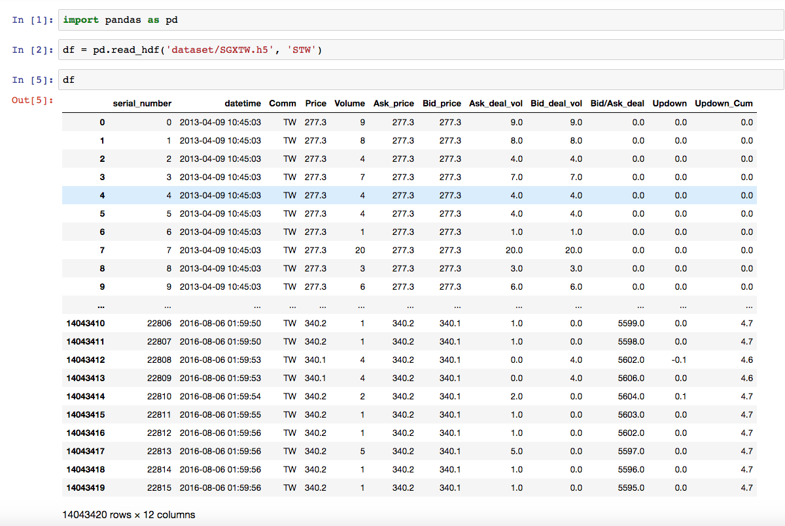

# QuickStart

## Prepare data for training environment

- tick level data

- the require columns of env 
  - strike price (the price deal in each tick) 
    use for calculate the reward and render but will not directly use in model as input, because the input may need the preprocessing. This can show human readable result like transaction, ploting and so on.
  - serial number of each date  
    currently v0 and v1 training env use each day as new game for training like the deepmind play the game, it will randomly choice one day to trade using serial number equal to zero to separate that.
  - at least one feature data 
    the feature data will be the state to return, it can simple like price, volumn, etc.

    

