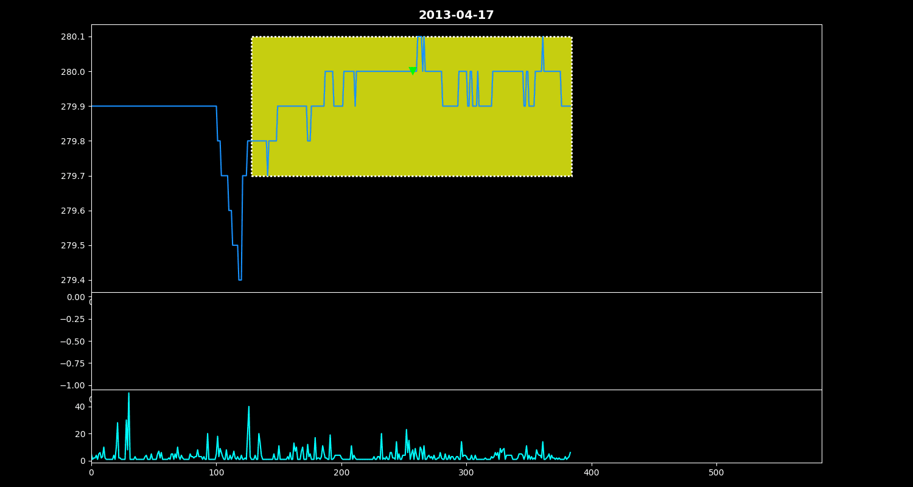

# TradingGym

[](https://travis-ci.org/Yvictor/TradingGym)

TradingGym is a toolkit for training and backtesting the reinforcement learning algorithms. This was inspired by OpenAI Gym and imitated the framework form. Not only traning env but also has backtesting and in the future will implement realtime trading env with Interactivate Broker API and so on.

This training env originally design for tickdata, but also support for ohlc data format. WIP.

### Installation
```
git clone https://github.com/Yvictor/TradingGym.git
cd TradingGym
python setup.py install
```

### Getting Started
``` python
import random
import numpy as np
import pandas as pd
import trading_env

df = pd.read_hdf('dataset/SGXTW.h5', 'STW')

env = trading_env.make(env_id='training_v1', obs_data_len=256, step_len=128,
                       df=df, fee=0.1, max_position=5, deal_col_name='Price', 
                       feature_names=['Price', 'Volume', 
                                      'Ask_price','Bid_price', 
                                      'Ask_deal_vol','Bid_deal_vol',
                                      'Bid/Ask_deal', 'Updown'])

env.reset()
env.render()

state, reward, done, info = env.step(random.randrange(3))

### randow choice action and show the transaction detail
for i in range(500):
    print(i)
    state, reward, done, info = env.step(random.randrange(3))
    print(state, reward)
    env.render()
    if done:
        break
env.transaction_details
```
- obs_data_len: observation data length
- step_len: when call step rolling windows will + step_len
- df exmaple
>|index|datetime|bid|ask|price|volume|serial_number|dealin|
>|-----|--------|---|---|-----|------|-------------|------|
>|0|2010-05-25 08:45:00|7188.0|7188.0|7188.0|527.0|0.0|0.0|
>|1|2010-05-25 08:45:00|7188.0|7189.0|7189.0|1.0|1.0|1.0|
>|2|2010-05-25 08:45:00|7188.0|7189.0|7188.0|1.0|2.0|-1.0|
>|3|2010-05-25 08:45:00|7188.0|7189.0|7188.0|4.0|3.0|-1.0|
>|4|2010-05-25 08:45:00|7188.0|7189.0|7188.0|2.0|4.0|-1.0|

- df: dataframe that contain data for trading 
> serial_number -> serial num of deal at each day recalculating

- fee: when each deal will pay the fee, set with your product. 
- max_position: the max market position for you trading share.
- deal_col_name: the column name for cucalate reward used.
- feature_names: list contain the feature columns to use in trading status.



### Training

#### simple dqn
- WIP
#### policy gradient
- WIP
#### actor-critic
- WIP
#### A3C with RNN
- WIP

### Backtesting

 - loading env just like training
``` python
env = trading_env.make(env_id='backtest_v1', obs_data_len=1024, step_len=512,
                       df=df, fee=0.1, max_position=5, deal_col_name='Price', 
                        feature_names=['Price', 'Volume', 
                                       'Ask_price','Bid_price', 
                                       'Ask_deal_vol','Bid_deal_vol',
                                       'Bid/Ask_deal', 'Updown'])
```
- load your own agent

``` python 
class YourAgent:
    def __init__(self):
        # build your network and so on
        pass
    def choice_action(self, state):
        ## your rule base conditon or your max Qvalue action or Policy Gradient action
         # action=0 -> do nothing
         # action=1 -> buy 1 share
         # action=2 -> sell 1 share
        ## in this testing case we just build a simple random policy 
        return np.random.randint(3)
```
- start to backtest
``` python
agent = YourAgent()

transactions = []
while not env.backtest_done:
    state = env.backtest()
    done = False
    while not done:
        state, reward, done, info = env.step(agent.choice_action(state))
        #print(state, reward)
        #env.render()
        if done:
            transactions.append(info)
            break
transaction = pd.concate(transactions)
transaction
```

<div>
<table border="1" class="dataframe">
  <thead>
    <tr style="text-align: right;">
      <th></th>
      <th>step</th>
      <th>datetime</th>
      <th>transact</th>
      <th>transact_type</th>
      <th>price</th>
      <th>share</th>
      <th>price_mean</th>
      <th>position</th>
      <th>reward_fluc</th>
      <th>reward</th>
      <th>reward_sum</th>
      <th>color</th>
      <th>rotation</th>
    </tr>
  </thead>
  <tbody>
    <tr>
      <th>2</th>
      <td>1537</td>
      <td>2013-04-09 10:58:45</td>
      <td>Buy</td>
      <td>new</td>
      <td>277.1</td>
      <td>1.0</td>
      <td>277.100000</td>
      <td>1.0</td>
      <td>0.000000e+00</td>
      <td>0.000000e+00</td>
      <td>0.000000</td>
      <td>1</td>
      <td>1</td>
    </tr>
    <tr>
      <th>5</th>
      <td>3073</td>
      <td>2013-04-09 11:47:26</td>
      <td>Sell</td>
      <td>cover</td>
      <td>276.8</td>
      <td>-1.0</td>
      <td>277.100000</td>
      <td>0.0</td>
      <td>-4.000000e-01</td>
      <td>-4.000000e-01</td>
      <td>-0.400000</td>
      <td>2</td>
      <td>2</td>
    </tr>
    <tr>
      <th>10</th>
      <td>5633</td>
      <td>2013-04-09 13:23:40</td>
      <td>Sell</td>
      <td>new</td>
      <td>276.9</td>
      <td>-1.0</td>
      <td>276.900000</td>
      <td>-1.0</td>
      <td>0.000000e+00</td>
      <td>0.000000e+00</td>
      <td>-0.400000</td>
      <td>2</td>
      <td>1</td>
    </tr>
    <tr>
      <th>11</th>
      <td>6145</td>
      <td>2013-04-09 13:30:36</td>
      <td>Sell</td>
      <td>new</td>
      <td>276.7</td>
      <td>-1.0</td>
      <td>276.800000</td>
      <td>-2.0</td>
      <td>1.000000e-01</td>
      <td>0.000000e+00</td>
      <td>-0.400000</td>
      <td>2</td>
      <td>1</td>
    </tr>
    <tr>
      <th>...</th>
      <td>...</td>
      <td>...</td>
      <td>...</td>
      <td>...</td>
      <td>...</td>
      <td>...</td>
      <td>...</td>
      <td>...</td>
      <td>...</td>
      <td>...</td>
      <td>...</td>
      <td>...</td>
      <td>...</td>
    </tr>
    <tr>
      <th>211</th>
      <td>108545</td>
      <td>2013-04-19 13:18:32</td>
      <td>Sell</td>
      <td>new</td>
      <td>286.7</td>
      <td>-1.0</td>
      <td>286.525000</td>
      <td>-2.0</td>
      <td>-4.500000e-01</td>
      <td>0.000000e+00</td>
      <td>30.650000</td>
      <td>2</td>
      <td>1</td>
    </tr>
    <tr>
      <th>216</th>
      <td>111105</td>
      <td>2013-04-19 16:02:01</td>
      <td>Sell</td>
      <td>new</td>
      <td>289.2</td>
      <td>-1.0</td>
      <td>287.416667</td>
      <td>-3.0</td>
      <td>-5.550000e+00</td>
      <td>0.000000e+00</td>
      <td>30.650000</td>
      <td>2</td>
      <td>1</td>
    </tr>
    <tr>
      <th>217</th>
      <td>111617</td>
      <td>2013-04-19 17:54:29</td>
      <td>Sell</td>
      <td>new</td>
      <td>289.2</td>
      <td>-1.0</td>
      <td>287.862500</td>
      <td>-4.0</td>
      <td>-5.650000e+00</td>
      <td>0.000000e+00</td>
      <td>30.650000</td>
      <td>2</td>
      <td>1</td>
    </tr>
    <tr>
      <th>218</th>
      <td>112129</td>
      <td>2013-04-19 21:36:21</td>
      <td>Sell</td>
      <td>new</td>
      <td>288.0</td>
      <td>-1.0</td>
      <td>287.890000</td>
      <td>-5.0</td>
      <td>-9.500000e-01</td>
      <td>0.000000e+00</td>
      <td>30.650000</td>
      <td>2</td>
      <td>1</td>
    </tr>
    <tr>
      <th>219</th>
      <td>112129</td>
      <td>2013-04-19 21:36:21</td>
      <td>Buy</td>
      <td>cover</td>
      <td>288.0</td>
      <td>5.0</td>
      <td>287.890000</td>
      <td>0.0</td>
      <td>0.000000e+00</td>
      <td>-1.050000e+00</td>
      <td>29.600000</td>
      <td>1</td>
      <td>2</td>
    </tr>
  </tbody>
</table>
<p>128 rows × 13 columns</p>
</div>


#### exmaple of rule base usage
- ma crossover and crossunder

``` python
env = trading_env.make(env_id='backtest_v1', obs_data_len=10, step_len=1,
                       df=df, fee=0.1, max_position=5, deal_col_name='Price', 
                       feature_names=['Price', 'MA'])
class MaAgent:
    def __init__(self):
        pass
        
    def choice_action(self, state):
        if state[-1][0] > state[-1][1] and state[-2][0] <= state[-2][1]:
            return 1
        elif state[-1][0] < state[-1][1] and state[-2][0] >= state[-2][1]:
            return 2
        else:
            return 0
# then same as above
```


